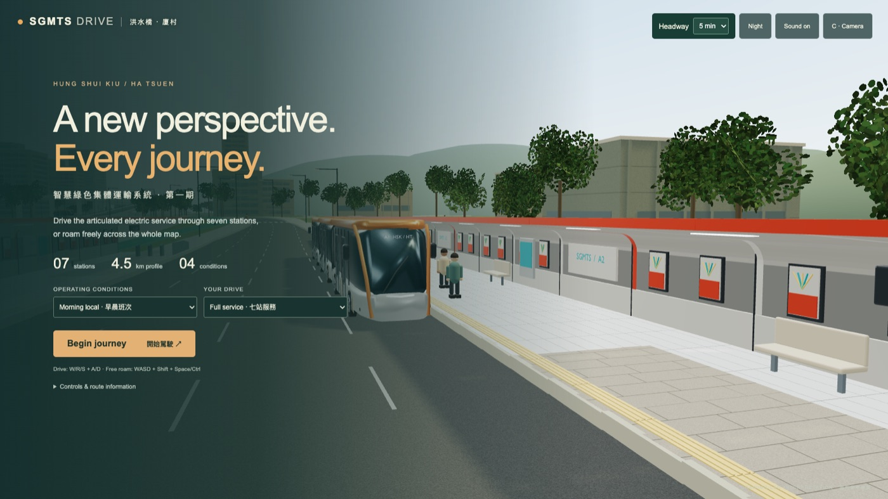
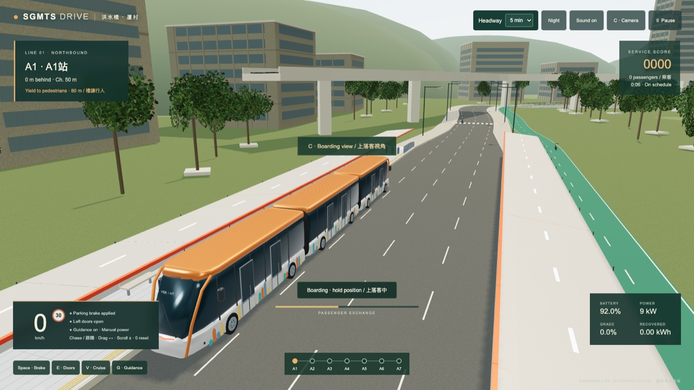
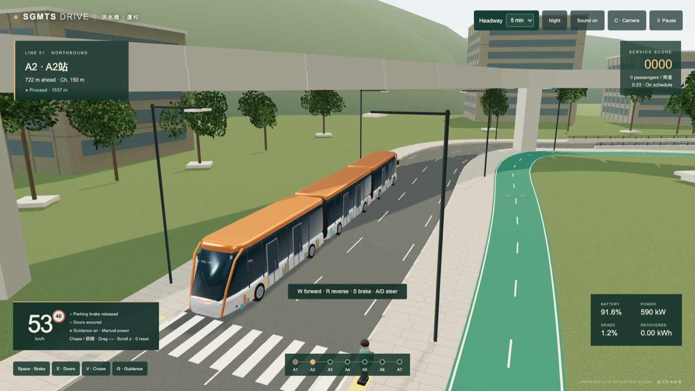
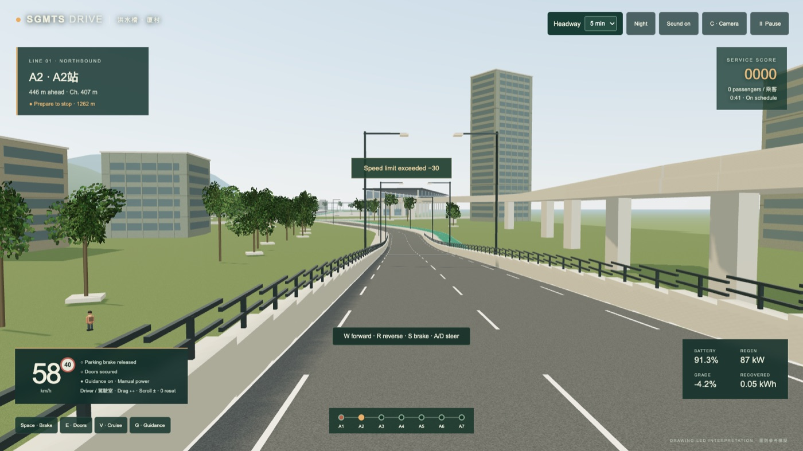
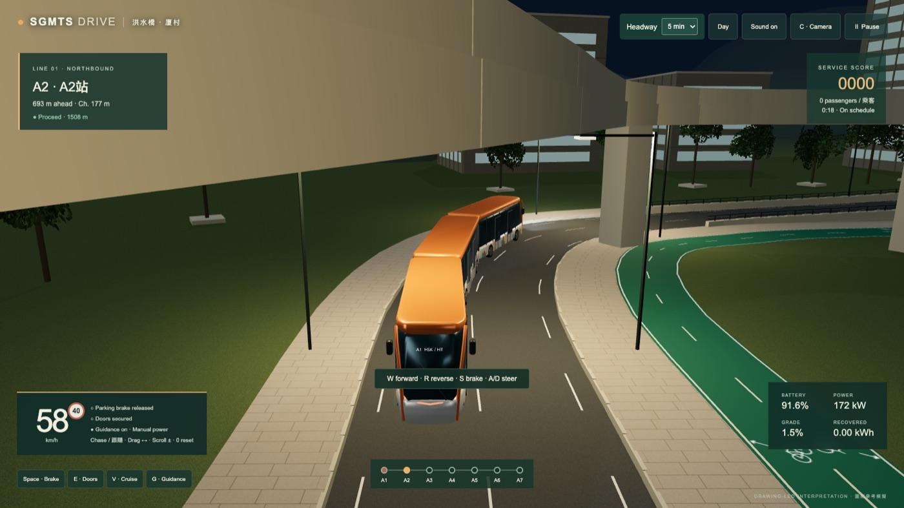
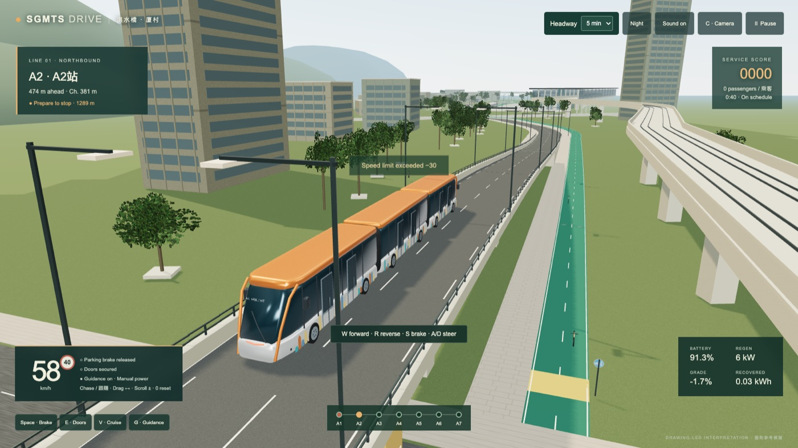

# SGMTS Drive

**Drive an articulated electric transit vehicle along the Hung Shui Kiu / Ha Tsuen corridor — seven stations, day and night, in your browser.**

▶️ **[Play it now — no download needed](https://gordonkwanwork-spec.github.io/sgmts-drive/)**

▶️ **[Play the saved recent version — 23 September 2026](https://gordonkwanwork-spec.github.io/sgmts-drive/versions/2026-09-23/)**



---

## What is this?

A driving game. You are the driver of an orange articulated electric vehicle running a
seven-station service. You pull up at each platform, open the doors, let passengers on and
off, close up, release the brake and drive to the next stop — watching your speed, the
signals, the battery and the timetable.

It runs entirely inside a web browser. Nothing to install, no account, no cost.

---

## Play in 30 seconds

1. Open **[the game link](https://gordonkwanwork-spec.github.io/sgmts-drive/)** in Chrome or Edge on a laptop or desktop.
2. Wait for the models to load (about 25 MB the first time — roughly 10–30 seconds).
3. Leave the two dropdowns as they are and click **Begin journey**.
4. You start at station A1 with the parking brake on. Press **E** to open the doors.
5. Wait for the passengers to finish boarding, press **E** again to close the doors.
6. Press **Space** to release the parking brake, then hold **W** to drive.
7. Steer with **A** and **D**. Slow down with **S**. Stop alongside the next platform and repeat.

That is the whole game. Everything below is optional.


*Doors open at A1. The bottom-left panel shows your speed, brake and door state; the bottom strip shows which of the seven stops you have reached.*

---

## Controls

Only five keys matter: **W** drive, **S** brake, **A**/**D** steer, **E** doors, **Space** parking brake.
The rest are there when you want them.

| Key | What it does |
|---|---|
| **W** / **R** / **S** | Forward / reverse / brake |
| **A** / **D** | Steer left / right |
| **Space** | Parking brake on/off (gradual emergency stop if you are moving) |
| **E** | Open / close the doors |
| **X** | Choose left or right doors while they are closed |
| **V** | Cruise assist — follows the marked route and manages speed; you handle doors and brake |
| **G** | Lane guidance on/off |
| **B** | Boarding ramp (doors open + brake applied) |
| **Q** | Acknowledge a passenger request |
| **C** | Cycle through six camera views |
| **Z** | Indicators |
| **H** | Horn |
| **M** | Mute |
| **P** or **Esc** | Pause |
| Mouse drag / wheel | Look around / zoom |

In **Free roam** you fly instead: **WASD** to move, **Shift** to go faster, **Space** / **Ctrl** for
altitude, drag to look.



---

## Route choices and live map

- Open **☰ Journey options** for settings and route choices. **Skip next station** selects the through lane for an express stop. Choose before the station approach.
- **Depot** selects the depot branch when approaching its entrance.
- Beyond A7, stop with doors closed and choose **Change cab** to cross to the return lane. Cruise returns via the A1 roundabout.
- Tap the circular nearby map to open the full route. Gold is your vehicle, blue arrows show other ART services and their directions, cream circles are stations, and the purple square identifies the depot. Only junctions crossing the corridor show signal phases.
- The circular button at the top right hides the interface. Tap it again to restore controls.

Menu music plays at launch when the browser permits audio. On a fresh mobile visit, tap **Play menu music** on the start screen to enable it before beginning a journey. Day and night driving tracks fade in as speed builds and fade out when stopped or crashed. **Sound** mutes both music and driving sounds.

## Things to try

Pick these from the two dropdowns on the start screen before you press *Begin journey*.

**Conditions** — Morning local, Golden hour, Rainy rush hour, Night service. Rain and darkness
change how far you can see and how long you take to stop. You can also flip between **Night**
and **Day** at any time with the button at the top of the screen.

**Drives**

| Drive | What you do |
|---|---|
| **Full service** | All seven stops, passengers, scoring and a final report at the end |
| **Accessible service** | Deploy the boarding ramp when it is requested |
| **Request & priority** | Acknowledge passenger requests (**Q**) and hold the departure |
| **A1 turnback** | Drive the tight terminal loop and stop cleanly after one circuit |
| **Explore the whole line** | Travel the full corridor, past A7, to the barrier at the end |
| **Free roam** | Fly around the map freely — no vehicle, no timetable |


*One of six camera views. Press **C** to cycle through them.*


*Night service: street, station and depot lighting, illuminated windows and your own headlights.*

---

## Tips

- **You cannot drive with the doors open** — and the doors will not close while the ramp is out.
- **Line the doors up with the platform.** The door openings are fixed on the left side of the vehicle.
- **Closing the doors early pauses boarding.** Let the passenger exchange finish.
- **Full lock turns in 15 m.** The vehicle follows its heading while moving and holds that heading when you let go of A/D.
- **Crashed into traffic or a kerb?** Choose **Recover vehicle** to be put back in the running lane.
- **Feeling rushed?** Press **V**. Cruise assist handles speed and approaches; you keep the doors and brake.

---

## Download and run it yourself

You do not need this to play — the [link above](https://gordonkwanwork-spec.github.io/sgmts-drive/) is
the same game. Do this only if you want the source, want to play offline, or want to change something.

**You will need [Node.js](https://nodejs.org) installed** (pick the "LTS" download, click through
the installer, accept the defaults).

### Mac

1. On this page click the green **Code** button → **Download ZIP**.
2. Double-click the downloaded ZIP in your Downloads folder to unpack it.
3. Open the unpacked folder and double-click **Start Game.command**.
   (The first time, macOS may say it cannot be opened: right-click it → **Open** → **Open**.)
4. The game opens in your browser. Leave the small black Terminal window open while you play;
   close it when you are done.

### Windows or Linux

1. Download and unpack the ZIP as above.
2. Open a terminal (Windows: PowerShell) in the unpacked folder.
3. Run these two commands:

```sh
npm install
npm run dev
```

4. Open the address it prints — usually <http://127.0.0.1:5173/>.

### Requirements

A modern WebGL browser on a desktop, phone or tablet. Touch devices have automatic steering and large Go, Stop, Doors and Camera controls. Desktop and emulated mobile Chrome have been checked; performance on physical phones and other browsers varies with the device.



---

## For developers

```sh
npm install
npm run dev      # dev server with hot reload
npm test         # simulation, geometry and layout checks
npm run build    # production build into dist/
```

Built with [Vite](https://vitejs.dev) and [three.js](https://threejs.org). No other runtime
dependencies, no external textures, no paid assets, no network calls during play.

| Path | Contents |
|---|---|
| `src/experience.js` | Rendering, camera, HUD, input |
| `src/simulation.js` | Vehicle physics, energy, scoring |
| `src/alignment.js` | Route geometry, chainage, stations |
| `src/environment.js` | Scenery, traffic, pedestrians, lighting |
| `src/operating.js` | Service logic, doors, signals, headways |
| `public/assets/*.glb` | Browser-ready vehicle and station models |
| `assets/blender/*.blend` | Editable Blender sources |
| `scripts/build_assets.py` | Regenerates the GLB models from Blender |

Rebuild the models (Blender 5.2):

```sh
/Applications/Blender.app/Contents/MacOS/Blender --background --python scripts/build_assets.py
```

`npm test` checks braking and load physics, the seven station corridors and platform geometry,
road widths and docking tapers, traction and door interlocks, grade separation, both traffic
directions stopping without overshoot, scenery clearance, and that every GLB is a valid,
correctly sized glTF binary.

Pushes to `main` build and publish `dist/` to GitHub Pages automatically
(`.github/workflows/pages.yml`).

---

## What this is not

This is a game, not an engineering model.

The route is a hand-traced alignment roughly 4.58 km long, with seven stations, elevated
sections, junctions, a depot and a cycleway. It is inspired by a Hong Kong transit corridor, but
the horizontal geometry is a smoothed trace rather than surveyed setting-out curves, and the
terrain, traffic volumes, junction placement, surrounding buildings and poster art are game
interpretations.

The simulation does model passenger mass, gradient forces, rolling resistance, regenerative
braking, door and ramp interlocks, signals and crossing traffic — but the numbers are tuned to
be fun and legible, not to predict real vehicle performance. Do not use it for anything that
matters.

### September lighting and driving update

Six views: third person, cockpit, platform, bird’s-eye, low front and low rear. Move the desktop mouse to look; click the scene to capture the pointer and press Esc to release it.

The depot has an open central bay. Stop with doors closed, then choose the left (A7) or right (A1) depot exit in options to change cab and return to the corridor. Road and cycle lighting use separate grey columns; station canopy strips and illuminated vehicle interiors are enabled at night.

Keyboard buttons: F go, T stop, E doors, C camera, P pause, O options, I map, U hide/show interface, N day/night, J depot, K change cab, L skip station, [ / ] depot exits, Y recover. Tab and Enter also operate the buttons. Click the scene to capture mouse-look; Esc releases it without moving the view while using the interface.

The editable vehicle model now includes front and rear Blender cockpits, curved consoles, live instruments, driver seats, orange/green passenger seats, stainless rails, hanging straps and open gangways. Cockpit view uses a driver-eye marker inside the active vehicle section: looking around leaves the controls fixed to the cab. Source: `assets/blender/art.blend`; reproducible builder: `scripts/build_assets.py --vehicle`.
