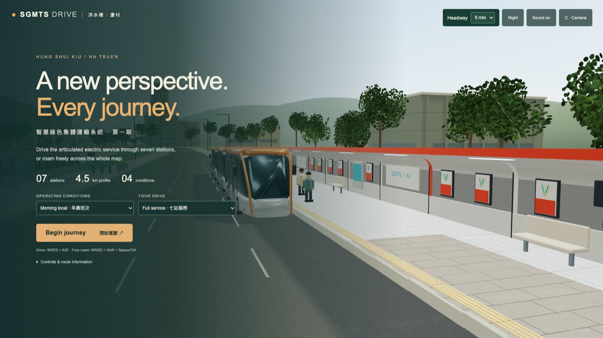
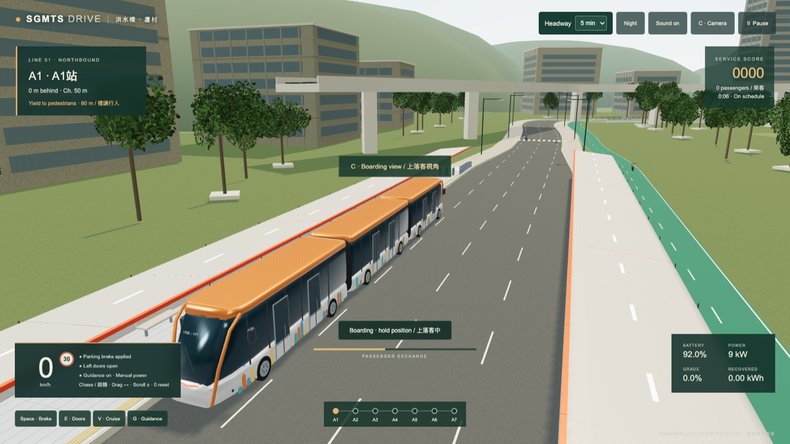
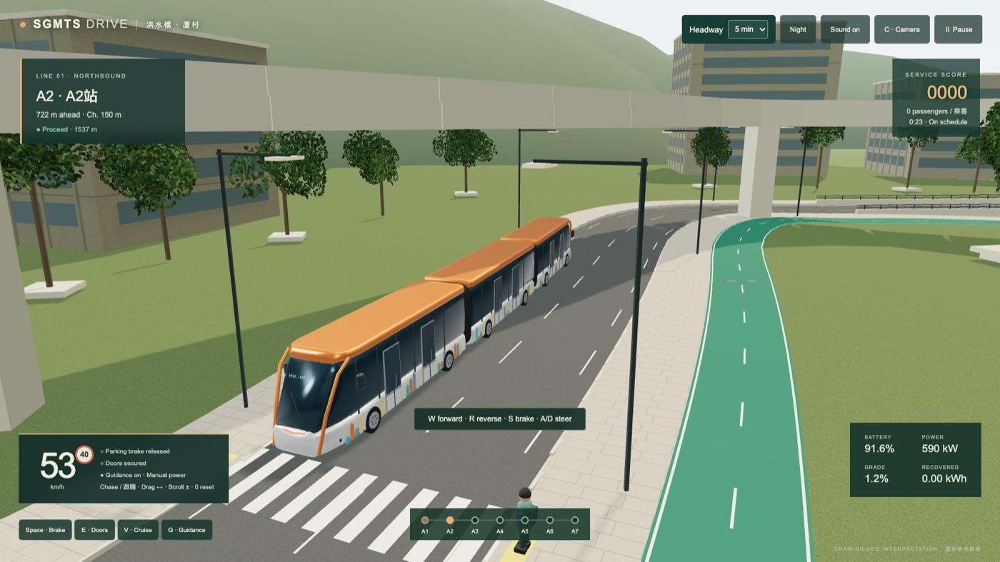
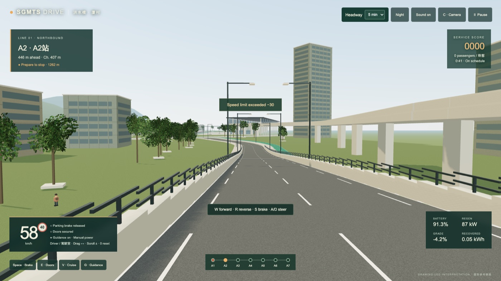
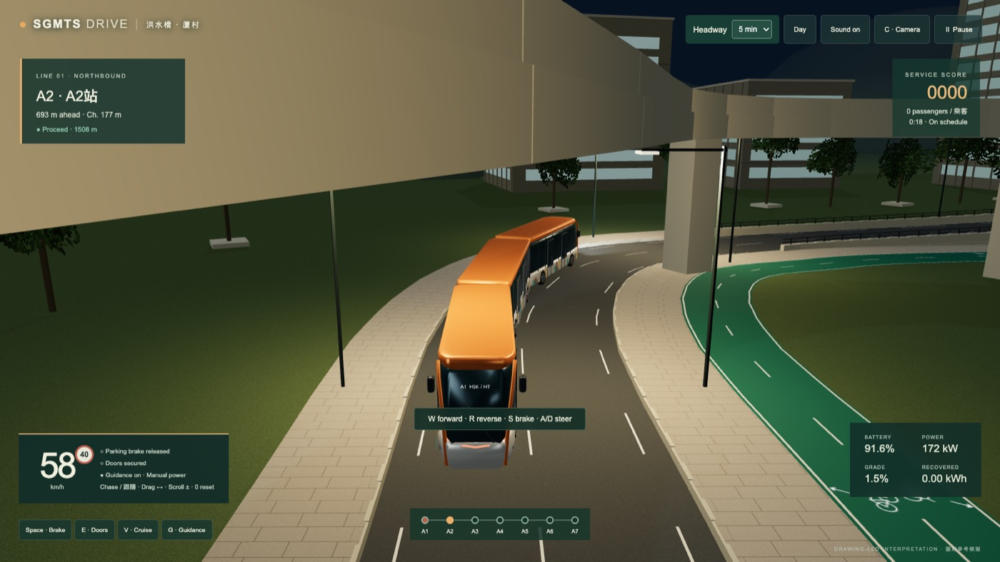
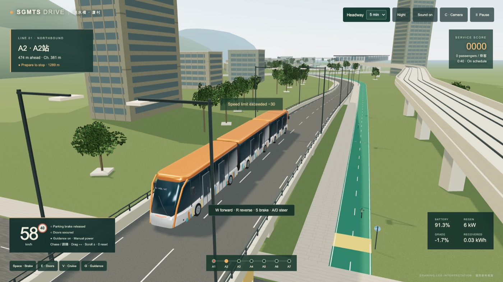

# SGMTS Drive

**Drive an articulated electric transit vehicle along the Hung Shui Kiu / Ha Tsuen corridor — seven stations, day and night, in your browser.**

▶️ **[Play it now — no download needed](https://gordonkwanwork-spec.github.io/sgmts-drive/)**

▶️ **[Play the saved recent version — 23 September 2026](https://gordonkwanwork-spec.github.io/sgmts-drive/versions/2026-09-23/)**



---

## What is this?

A driving game. You are the driver of an orange articulated electric vehicle running a
seven-station service. You pull up at each platform, open the doors, let passengers on and
off, close up, release the brake and drive to the next stop — watching your speed, the
signals, the battery and the timetable.

It runs entirely inside a web browser. Nothing to install, no account, no cost.

---

## Play in 30 seconds

1. Open **[the game link](https://gordonkwanwork-spec.github.io/sgmts-drive/)** in Chrome or Edge on a laptop or desktop.
2. Wait for the models to load (about 25 MB the first time — roughly 10–30 seconds).
3. Leave the two dropdowns as they are and click **Begin journey**.
4. You start at station A1 with the parking brake on. Press **E** to open the doors.
5. Wait for the passengers to finish boarding, press **E** again to close the doors.
6. Press **Space** to release the parking brake, then hold **W** to drive.
7. Steer with **A** and **D**. Slow down with **S**. Stop alongside the next platform and repeat.

That is the whole game. Everything below is optional.


*Doors open at A1. The bottom-left panel shows your speed, brake and door state; the bottom strip shows which of the seven stops you have reached.*

---

## Controls

Only five keys matter: **W** drive, **S** brake, **A**/**D** steer, **E** doors, **Space** parking brake.
The rest are there when you want them.

| Key | What it does |
|---|---|
| **W** / **R** / **S** | Forward / reverse / brake |
| **A** / **D** | Steer left / right |
| **Space** | Parking brake on/off (gradual emergency stop if you are moving) |
| **E** | Open / close the doors |
| **X** | Choose left or right doors while they are closed |
| **V** | Cruise assist — follows the marked route and manages speed; you handle doors and brake |
| **G** | Lane guidance on/off |
| **B** | Boarding ramp (doors open + brake applied) |
| **Q** | Acknowledge a passenger request |
| **C** | Cycle through six camera views |
| **Z** | Indicators |
| **H** | Horn |
| **M** | Mute |
| **P** or **Esc** | Pause |
| Mouse drag / wheel | Look around / zoom |

In **Free roam** you fly instead: **WASD** to move, **Shift** to go faster, **Space** / **Ctrl** for
altitude, drag to look.



---

## Route choices and live map

- Open **☰ Journey options** for settings and route choices. **Skip next station** selects the through lane for an express stop. Choose before the station approach.
- **Depot** selects the depot branch when approaching its entrance.
- Beyond A7, stop with doors closed and choose **Change cab** to cross to the return lane. Cruise returns via the A1 roundabout.
- Tap the circular nearby map to open the full route. Gold is your vehicle, blue arrows show other ART services and their directions, cream circles are stations, and the purple square identifies the depot. Only junctions crossing the corridor show signal phases.
- The circular button at the top right hides the interface. Tap it again to restore controls.

The menu has separate **Menu music** and **Gameplay music** selectors with Automatic, Music off and all 23 recordings (20 new Suno versions plus three original tracks). Choices persist on this browser. **Journey options → Gameplay music** changes the current soundtrack immediately and stays synchronized with the main menu. The compact launch menu uses a location dropdown for free roam. Automatic matches the loading layout, morning/sunset/rain/night driving, free roam/walking/cycling, control centre and completion screen. Tracks crossfade and overlap their final four seconds when repeating. Music stays quieter at stops and ducks quickly for announcements; pause/crash fades it out. Tap **Play menu music** if the browser needs a user gesture. **Music off** preserves vehicle sounds; **Sound** mutes the whole mixer. Only two media streams are used, with per-track gain matching; masters remain in `Music/`, browser MP3s in `public/audio/soundtrack/`.

## Things to try

Pick these from the two dropdowns on the start screen before you press *Begin journey*.

**Conditions** — Morning local, Golden hour, Rainy rush hour, Night service. Rain and darkness
change how far you can see and how long you take to stop. You can also flip between **Night**
and **Day** at any time with the button at the top of the screen.

**Drives**

| Drive | What you do |
|---|---|
| **Full service** | All seven stops, passengers, scoring and a final report at the end |
| **Accessible service** | Deploy the boarding ramp when it is requested |
| **Request & priority** | Acknowledge passenger requests (**Q**) and hold the departure |
| **A1 turnback** | Drive the tight terminal loop and stop cleanly after one circuit |
| **Explore the whole line** | Travel the full corridor, past A7, to the barrier at the end |
| **Free roam** | Fly around the map freely — no vehicle, no timetable |


*One of six camera views. Press **C** to cycle through them.*


*Night service: street, station and depot lighting, illuminated windows and your own headlights.*

---

## Tips

- **You cannot drive with the doors open** — and the doors will not close while the ramp is out.
- **Line the doors up with the platform.** The door openings are fixed on the left side of the vehicle.
- **Closing the doors early pauses boarding.** Let the passenger exchange finish.
- **Full lock turns in 15 m.** The vehicle follows its heading while moving and holds that heading when you let go of A/D.
- **Crashed into traffic or a kerb?** Choose **Recover vehicle** to be put back in the running lane.
- **Feeling rushed?** Press **V**. Cruise assist handles speed and approaches; you keep the doors and brake.

---

## Download and run it yourself

You do not need this to play — the [link above](https://gordonkwanwork-spec.github.io/sgmts-drive/) is
the same game. Do this only if you want the source, want to play offline, or want to change something.

**You will need [Node.js](https://nodejs.org) installed** (pick the "LTS" download, click through
the installer, accept the defaults).

### Mac

1. On this page click the green **Code** button → **Download ZIP**.
2. Double-click the downloaded ZIP in your Downloads folder to unpack it.
3. Open the unpacked folder and double-click **Start Game.command**.
   (The first time, macOS may say it cannot be opened: right-click it → **Open** → **Open**.)
4. The game opens in your browser. Leave the small black Terminal window open while you play;
   close it when you are done.

### Windows or Linux

1. Download and unpack the ZIP as above.
2. Open a terminal (Windows: PowerShell) in the unpacked folder.
3. Run these two commands:

```sh
npm install
npm run dev
```

4. Open the address it prints — usually <http://127.0.0.1:5173/>.

### Requirements

A modern WebGL browser on a desktop, phone or tablet. Touch devices have automatic steering and large Go, Stop, Doors and Camera controls. Desktop and emulated mobile Chrome have been checked; performance on physical phones and other browsers varies with the device.



---

## For developers

```sh
npm install
npm run dev      # dev server with hot reload
npm test         # simulation, geometry and layout checks
npm run build    # production build into dist/
```

Built with [Vite](https://vitejs.dev) and [three.js](https://threejs.org). No other runtime
dependencies, no external textures, no paid assets, no network calls during play.

| Path | Contents |
|---|---|
| `src/experience.js` | Rendering, camera, HUD, input |
| `src/simulation.js` | Vehicle physics, energy, scoring |
| `src/alignment.js` | Route geometry, chainage, stations |
| `src/environment.js` | Scenery, traffic, pedestrians, lighting |
| `src/operating.js` | Service logic, doors, signals, headways |
| `public/assets/*.glb` | Browser-ready vehicle and station models |
| `assets/blender/*.blend` | Editable Blender sources |
| `scripts/build_assets.py` | Regenerates the GLB models from Blender |

Rebuild the models (Blender 5.2):

```sh
/Applications/Blender.app/Contents/MacOS/Blender --background --python scripts/build_assets.py
```

`npm test` checks braking and load physics, the seven station corridors and platform geometry,
road widths and docking tapers, traction and door interlocks, grade separation, both traffic
directions stopping without overshoot, scenery clearance, and that every GLB is a valid,
correctly sized glTF binary.

Pushes to `main` build and publish `dist/` to GitHub Pages automatically
(`.github/workflows/pages.yml`).

---

## What this is not

This is a game, not an engineering model.

The route is a hand-traced alignment roughly 4.58 km long, with seven stations, elevated
sections, junctions, a depot and a cycleway. It is inspired by a Hong Kong transit corridor, but
the horizontal geometry is a smoothed trace rather than surveyed setting-out curves, and the
terrain, traffic volumes, junction placement, surrounding buildings and poster art are game
interpretations.

The simulation does model passenger mass, gradient forces, rolling resistance, regenerative
braking, door and ramp interlocks, signals and crossing traffic — but the numbers are tuned to
be fun and legible, not to predict real vehicle performance. Do not use it for anything that
matters.

### September lighting and driving update

Six views: third person, cockpit, platform, bird’s-eye, low front and low rear. Move the desktop mouse to look; click the scene to capture the pointer and press Esc to release it.

The depot has an open central bay. Stop with doors closed, then choose the left (A7) or right (A1) depot exit in options to change cab and return to the corridor. Road and cycle lighting use separate grey columns; station canopy strips and illuminated vehicle interiors are enabled at night.

Keyboard buttons: F go, T stop, E doors, C camera, P pause, O options, I map, U hide/show interface, N day/night, J depot, K change cab, L skip station, [ / ] depot exits, Y recover. Tab and Enter also operate the buttons. Click the scene to capture mouse-look; Esc releases it without moving the view while using the interface.

The editable vehicle model now includes front and rear Blender cockpits, curved consoles, live instruments, driver seats, orange/green passenger seats, stainless rails, hanging straps and open gangways. Cockpit view uses a driver-eye marker inside the active vehicle section: looking around leaves the controls fixed to the cab. Source: `assets/blender/art.blend`; reproducible builder: `scripts/build_assets.py --vehicle`.

### Blender streetscape kit

`assets/blender/street-kit.blend` contains four building templates (residential, office, village and logistics), five road vehicles, twelve pedestrians (men, women, children, older adults and two wheelchair users), a seated cyclist, and five vegetation templates (grass, meadow grass, ferns, shrubs and flowering shrubs). Each named root is a reusable model at the origin; hide the other roots when editing one. `public/assets/street-kit.glb` is loaded by the game, with shared geometry and instanced buildings. The cyclist's legs follow the pedals and the wheels rotate with travel; pedestrians retain their walking/boarding animation.

Rebuild the kit with:

```sh
/Applications/Blender.app/Contents/MacOS/Blender --background --python scripts/build_street_assets.py
```

The orange tram includes rooftop HVAC, service panels, open glazed door frames and recessed cabin LEDs. Night mode illuminates all passenger interiors; three local lights add illumination to the player's tram. AI interiors use emissive materials to keep the light count bounded. `npm test` checks the exported templates, limb pivots, complete pedal cycle and cabin LEDs. These are stylised game models, with physical-phone performance still unmeasured.

Verge planting uses shared Blender geometry in spatially culled instances. A height-weighted wind shader keeps plant bases fixed and varies gust phase by location. Connecting-road lamps cover the crossing roads, D1 link, L35 bend, depot approach and A1 loop, with fixed road-oriented pavement illumination. Other vehicles and bicycles have emissive lamps and a pool of four nearby headlights that illuminate surfaces; distant vehicles retain visible lamps. Wheelchair users remain seated and roll their wheels during movement.

### Tuen Ma Line viaduct trains

Two independently moving eight-car trains now use the opening railway viaduct, with each car and bogie following its curvature. The editable Blender formation includes cab masks and wipers, bilingual destination boards, five door pairs per side, transparent saloon windows, seats, handrails, gangways, wheelsets, brake discs, underfloor equipment, roof HVAC and two raised pantographs per train. Contact and messenger wires, droppers, gantries, track sleepers and illuminated viaduct fixtures complete the railway. Night mode enables passenger lighting, directional headlights/tail lights and viaduct downlights. Spatial synthesized rail roar, wheel pulses and traction tone respond to distance, stereo position, pause and the existing Sound control.

- Native source: `assets/blender/tuen-ma-train.blend`; browser asset: `public/assets/tuen-ma-train.glb`.
- Rebuild: `/Applications/Blender.app/Contents/MacOS/Blender -b -P scripts/build_tuen_ma.py`.
- Check: `node src/checks/railway.test.js` (also included in `npm test`).
- Visual reference: [MTR's Tuen Ma C-Train model](https://estore.mtr.com.hk/en/products/mtr-train-model-tml-ctrain); [MTR network endpoints](https://www.mtr.com.hk/en/corporate/operations/detail_network.html).
- This is a detailed game interpretation, not a dimensionally certified rolling-stock model. Trains run continuously at 57.6 km/h; scenic tunnels conceal recycling beyond the map. Railway sound is synthesized, not a field recording. Station stops and passenger exchange on these background trains are not simulated.

### Station advertising

All seven stations have framed 15 × 5 m rooftop billboards on both platforms,
with separate readable faces, roof supports and dedicated floodlight fixtures.
Artwork stays readable from shaded and opposite sides in daylight and at night,
using unlit print materials and glowing lamp lenses without extra realtime lights.
Placement respects the station stagger and route grade. The original A2–A3–A6
campaigns advertise 洪水橋大學城, 連接中國 and 物流空間出租.
Ten additional GPT-generated Traditional Chinese designs cover A1, A4, A5 and A7,
plus six campaigns on 24 nearby building facades, up to 24 × 8 m.
All graphics are saved as `public/assets/adverts/billboard-*.png`; exact new prompts
are in `docs/corridor-billboard-prompts.json`. Original prompts and the government
source for the university-town name are in `docs/rooftop-advert-prompts.json`.
These are fictional game advertisements. Day/night proof captures are in
`output/playwright/corridor-billboards/`.

The existing 364 platform poster frames carry seven photographic campaigns created
with the built-in GPT image tool: A1 Northern Metropolis, A2 new technology,
A3 university town, A4 green living, A5 arts and culture, A6 logistics cluster,
and A7 artificial intelligence. These are fictional promotional artworks.
Full-resolution textures are in `public/assets/adverts/A1.png` through `A7.png`;
the exact generation prompts are in `docs/station-advert-prompts.json`.
The runtime overlay follows the baked poster frames, A1 flare, A2 stagger and route
grade, with one shared texture and one additional draw call per station. The
backlit artwork remains legible at night. Regression checks run with `npm test`;
day and opposite-platform night captures are in `output/playwright/station-adverts/`.

Station canopies now use closed 120 mm Blender shells and seven distinct accent colours, with separately emissive bilingual signs. Cycling approaches use 420 mm closed decks and regular piers. Six nearby street lights illuminate people and foliage at night; tree planting mixes four canopy forms/colours with shrub bases. Check structures with `node src/checks/viaduct-lighting.test.js`; station asset checks are included in `npm test`.

Performance: inactive local lights are removed from daylight shaders; night light counts stay fixed to avoid shader recompilation while moving. Vegetation uses full detail within 65 m, simplified Blender geometry beyond that, and culling beyond 550 m. The 3D canvas uses at most one render pixel per CSS pixel on Retina displays; HTML controls remain native-resolution.

### Running tram wraps

Half the tram fleet carries reference-inspired Traditional Chinese advertising:
yellow football, orange finance, red/orange travel or blue rewards. Alternating
vehicles are wrapped across the combined player, AI and depot fleet: 11 of 23
(the nearest half for an odd total), including 9 of 18 running vehicles.
The four fictional GPT-generated designs are in `public/assets/tram-adverts/`;
prompts are in `docs/tram-advert-prompts.json`.
Each side prints one main graphic on the middle section, with campaign colour
continuing around the body and roofs. Film covers only the lower half of selected
passenger windows; upper panes and cab windshields remain clear. Prints follow
sliding doors and articulation without changing the vehicle geometry.

---

## Lot editor (developers)

`npm run dev`, then open **http://localhost:5199/editor.html**. It edits the development lots around the corridor, one lot at a time, over the S/HSK/2A Outline Zoning Plan.

- **Data:** `public/lots/lots.json`. There are 74 lots seeded from the OZP, each with a planning area, zone, height limit and plot ratio from the Notes. **Save** (Ctrl/Cmd+S) writes to this file.
- **Models:** drop `.glb` files onto the editor. They are copied to `public/lots/models/` and assigned to the selected lot. Author models in metres, Y up, with the origin at the centre of the ground floor. Use Rotation, Scale, Offset, **Fit to lot** and **Align to longest edge** to place them.
- **Tools:** Select (drag corners to reshape), **Wand** (click inside an OZP lot to trace it) and **Draw** (click corners).
- **In the game:** lots set to *Placeholder massing* or a GLB replace the game's filler buildings inside their boundary. Lots set to *None* keep the existing scenery. Stations, roads and the depot are never altered, and buildings are skipped wherever they would intrude on game scenery.
- **Labels ignored:** the wand traces `public/lots/ozp-mask.png`, which keeps the plan's black lines but drops the labels printed on or against them (G/IC, O, OU, site circles, height triangles, road names), so lots follow the lines instead of notching around the text (`scripts/ozp_lines.py`). If that cleaning ever opens a gap in a real line, the wand notices that the lot has grown much larger than on the unfiltered `ozp-mask-raw.png` and uses that outline instead. `scripts/retrace-lots.mjs` re-traces saved lots, but replaces one only when the new outline contains the old one and is at most 35% larger, so lots edited by hand stay as they are.
- **Plan underlay:** `python3 scripts/build_ozp_underlay.py "Annex II_S_HSK_2A.pdf"`. The underlay is aligned to the corridor at 1:7500, with A1 as the anchor. `scripts/seed-lots.mjs` re-seeds from `scripts/ozp-lot-labels.json` without overwriting lots you have edited.

## Street furniture editor (developers)

`npm run dev`, then open **http://localhost:5199/street.html**, or double-click **Edit Street.command** in the project folder. It controls exactly what stands along the corridor and the connecting roads: street lamps, cycle-track lamps, litter bins, post boxes, manhole covers, wayfinding and cycle signs, traffic signal heads, HyD Type 2 railing runs and footpath paving.

- **Data:** `public/street/furniture.json`. It was seeded from the old procedural layout (`scripts/seed-furniture.mjs`), so the game looked the same on day one. Each item stores a road, chainage, side (L = left in the direction of increasing chainage), offset (from the kerb outwards, or from the centreline), rotation and raise. Railings and paving are runs from one chainage to another. **Save** (Ctrl/Cmd+S) writes the file, and the game reads it at start-up.
- **Roads:** the SGMTS corridor and cycle track (design chainage, the same "Ch." as the HUD), L35, every junction and underpass crossing road, D1, the L35 bend, the depot approach, the depot service road and the A1 terminal loop. On those other roads, chainage is metres from the start of the road.
- **Tools:** **Place** (P) snaps to 0.5 m chainage and 0.05 m offset (Alt-click places without snapping). **Run** (R) takes two clicks. **Select** (S) lets you drag items along their road; Shift-click or Shift-drag selects several. Q/E rotate, and the arrow keys nudge chainage and offset. **Repeat** fills every N m between two chainages, optionally mirrored to the other side. The filters on the left select a stretch of road for bulk move, rotate, retype or delete.
- **Direction:** every arrow points to the item's front: lamp arms, sign faces, signal lenses and bin apertures.
- **Your models:** drop `.glb` files onto the editor. They are copied to `public/street/models/` and can then be placed like any other item. Author models in metres, Y up, with the origin at the base and the front facing −Z. *Light at m* makes a model light the pavement at night.
- **Signals:** a traffic signal head keeps its junction and phase (corridor, side road or pedestrian), so moving or rotating it leaves the signal timing unchanged.
- **Night:** baked pavement light pools are recalculated when the game or the editor reloads.

### Operations control centre

Choose **Control centre / 營運控制中心** on the start screen to operate the running fleet from a live corridor map. Select a tram to set its speed ceiling, hold/release it, skip an intermediate station or terminate at A1/A7. Select a junction to inspect road queues, waiting times, signal aspects and the reason for each adaptive decision. Three live 3D CCTV views follow selected trams, junctions and stations.

**Guided operator** explains the essentials; **Signal engineer** exposes timing parameters, pressure scores, detector occupancy, stage requests, isolation and simulated detector failure. Tram priority is conditional: minimum greens, bounded extension, overdue road/pedestrian demand and crossing clearance take precedence. Play a five-minute shift, review its performance and continue in sandbox. Export the session log from the operations panel.

See [operator instructions, controller rules and real-world references](CONTROL-CENTRE.md). This mode is an educational game interpretation; static depot vehicles and background MTR trains remain scenery, and route reversals use only the existing terminal facilities.

### A2 plaza and corridor advertising

The A2 interchange plaza now includes nine double-sided advertising lightboxes,
colourful Hung Shui Kiu lettering, circular seating, yellow loungers, activity paving,
planted benches, four pergolas and cycle stands. These new lightboxes are exclusive to
the plaza; existing station posters remain unchanged. The fountain and interchange
entrances are retained. Walking height follows the raised plaza paving.

The selected GPT-generated Hong Kong artwork is reused from
`public/assets/plaza/hk-adverts.png`: shopping, wetland and music plaza posters; community, family-day and
cycling banners on existing station-approach railings. Artwork uses inset texture
coordinates to exclude selection labels and frames. Fence banners span contiguous
panels, limited to one or two beside each crossing, intersection and station end,
with nearby targets sharing a pair. The A1 loop end has no railing and stays clear.
Crossing and junction clearances are retained. Night mode illuminates all ad faces,
lettering and fixtures using shared materials and the existing fixed pavement-lighting
system. Banner geometry is merged by material and corridor chunk.

Run `node src/checks/plaza.test.js` for artwork bounds, placement, walking-height and
crossing-exclusion checks. Implementation: `src/plaza.js` and `src/environment.js`.

### NPC reference rebuild

All twelve pedestrian identities and the cyclist use skinned human meshes with
facial textures and clothing colours derived from the thirteen sheets in
`assets/character-references/2026-09-29/`. They share the existing 21-bone animation
layout. Walking, running, seated passengers, wheelchair users and the cyclist all
load the rebuilt `public/assets/street-kit.glb`; its editable source is
`assets/blender/street-kit.blend` (textures packed).

The CC0 base topology, age/sex shapes and weights come from MakeHuman. The pinned
revision and original asset licence are retained in
`assets/character-source/makehuman/`. Face landmarks, baked textures and their
source mapping are in `assets/character-source/`. These are game-resolution
interpretations of the sheets; hair, garment construction and facial likeness
remain simplified rather than scan-quality reconstructions.

Rebuild textures with `python3 scripts/prepare_character_textures.py`, then run
Blender in background mode with `-P scripts/build_street_assets.py -- --people`.
The people-only rebuild preserves the kit's scenery and street furniture.
Run `npm test` and `npm run build` after rebuilding. A local comparison viewer is
at `/output/npc-rebuild/viewer.html` on the development server.
